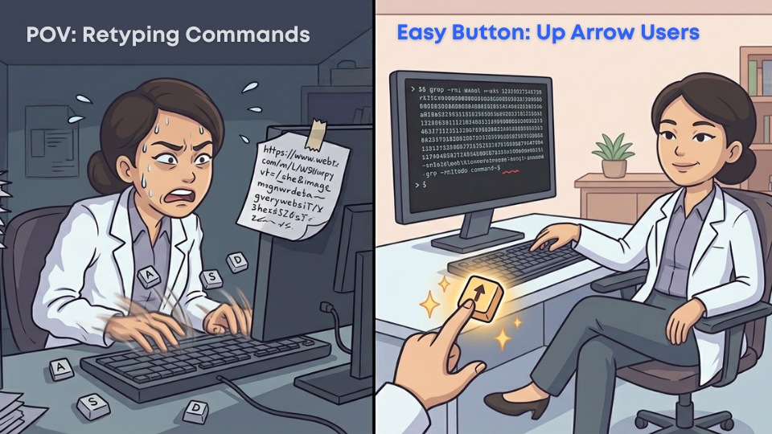

This is a focused, ~30–45 minute walkthrough that covers the handful of command-line moves you will use most often. It is organized around a single running example so that the commands connect into a workflow, rather than sitting as isolated tricks. If you want the leisurely, deeply-annotated version (with full vocabulary callouts and a 30-question review), see the [Extended walkthrough](macos-extended.qmd).

---

## 1. Finding and opening the Terminal

Press `Cmd + Space` to open Spotlight search (the magnifying-glass icon at the top-right of your screen), begin typing `Terminal`, and press `Return` when you see it. A window opens with a text prompt inside it. That window is where you will type every command in this walkthrough.

---

## 2. What the prompt looks like

When Terminal first opens you will see a line of text that looks something like this:

```
yourname@Your-MacBook-Pro ~ %
```

Reading it left to right:

- `yourname` — the account you are logged in as.
- `Your-MacBook-Pro` — the name of your machine.
- `~` — the current directory. `~` (a tilde) always means *your home directory*, which on macOS is `/Users/yourname`.
- `%` — the end of the prompt. Everything you type will appear after it, on the same line.

Whenever this guide says "at the prompt," it means: type this into the Terminal window, then press `Return`.

---

## 3. Get oriented: where am I, what is here?

Type these two commands, one at a time:

```bash
pwd
ls
```

- `pwd` — **"print working directory."** Tells you which folder you are currently sitting in.
- `ls` — **"list."** Shows the contents of that folder.

For a richer listing, use these four flags together:

```bash
ls -lhra
```

- `-l` — long form (permissions, size, date)
- `-h` — human-readable sizes (`4.0K`, `1.2M`)
- `-r` — reverse the sort order
- `-a` — show all files, including hidden ones (names starting with `.`)

Memorize `ls -lhra`. It is the single most useful flag combination in this walkthrough.

::: {.callout-tip}
## Tab completion, reminder #1: start using it right now
Whenever you type a file or folder name, type only the first few letters and then press the <kbd>Tab</kbd> key. The Terminal will fill in the rest for you. This prevents typos, saves keystrokes, and confirms that the thing you are typing actually exists. If Tab refuses to complete a name, the file or folder is not where you think it is. **You will see this reminder several more times. That is on purpose.**
:::

{#fig-mac-qs-tab fig-alt="A widescreen meme-style photograph of a deep desert canyon with reddish-brown rock walls under a hazy sky. Two scientists in white lab coats stand on opposite rims of the canyon. A giant monolithic gray keycap labeled 'TAB' with a right-facing arrow spans the gap between them like a bridge. Bold blue text at the top of the image reads 'The Difference Between The Furstrated Scientist, And The Confident Scientist!' (the word 'frustrated' is misspelled in the original image). White text at the bottom reads 'One key. Tab.'"}

---

## 4. When to use `~` (and when it is not necessary)

`~` is a shortcut for your home directory (`/Users/yourname`). Use it whenever you need to write a path that starts from home:

- `cd ~/Desktop` — go to the Desktop
- `ls ~/Documents` — list the contents of Documents
- `cat ~/Projects/quick_look/ReadMe.txt` — read a file that lives many folders below home

You do **not** need `~` when the file or folder you are referring to is already inside the directory you are standing in. For example, if you are already inside `~/Desktop` and want to look at a file called `notes.txt` that lives there, this is enough:

```bash
cat notes.txt
```

You do *not* need to write `cat ~/Desktop/notes.txt`. The shorter form works because `notes.txt` is a **relative path** (understood relative to your current directory, whatever that happens to be). Reach for `~` only when the path you want does not begin at your current location.

A quick rule of thumb: **if `pwd` already shows you are in the folder that contains the thing you want, you do not need `~`.**

**Using the up arrow (Power move)**

You can use the <kbd>↑</kbd> arrow key on your keyboard to scroll back through your previously executed commands. This is useful when:

- You want to reuse a previous command.
- A command you typed gave an error and you want to fix the previous command.
- You need to recall previous actions and you are not sure what commands you issued.

{#fig-win-quick-up-arrow fig-alt="A two-panel vector-style cartoon illustration comparing different approaches to using a terminal command line. A scientist in a white lab coat as the central character in both scenarios. In the left panel, she is depicted as highly stressed, with sweat droplets and a panicked expression, hunched over a cluttered desk in a dim office. She is typing frantically, and as loose keyboard keys labeled A, S, and D pop off. The right panel contrasts this with the same scientist now sitting calmly and smiling in a clean, well-lit office, with an inset view showing her hand easily recalling previous commands using the up arrow."}

---

## 5. The running example

The rest of this walkthrough follows one continuous scenario. You have decided to take a quick look at some new code (or a new dataset) and want a scratch folder on your Desktop to work in.

### 5.1 Create a `quick_look` folder on your Desktop

```bash
cd ~/Desktop
mkdir quick_look
cd quick_look
pwd
```

The `pwd` at the end confirms you are now inside `~/Desktop/quick_look`.

::: {.callout-tip}
## Tab completion, reminder #2
When typing `cd ~/Desktop`, you can type `cd ~/Des` and then press <kbd>Tab</kbd>. Every long path in this walkthrough is a good excuse to practice this.
:::

### 5.2 Create and edit `ReadMe.txt`

Create the file and open it in **nano**, a simple text editor that runs inside the Terminal window itself:

```bash
nano ReadMe.txt
```

A nano editor screen appears inside the Terminal. Type in these lines (you can copy-paste from your browser with <kbd>Ctrl</kbd> + <kbd>V</kbd>):

```
Quick Look project
==================
Poking around at some new code.

TODO: figure out what this project actually does
TODO: write down my first impressions
```

Save the file: press <kbd>Ctrl</kbd> + <kbd>O</kbd>, then <kbd>Return</kbd> to confirm the filename.  
Exit nano: press <kbd>Ctrl</kbd> + <kbd>X</kbd>.

Now preview what you wrote *without* opening any editor at all:

```bash
cat ReadMe.txt
```

`cat` prints the contents of a file straight to the Terminal. For short files it is the fastest possible way to remind yourself what is inside without waiting for an editor to open. For a big file, though, `cat` will flood your Terminal with output. The [Extended walkthrough](macos-extended.qmd) introduces `head`, a sibling command that prints only the first few lines of any file.

.](images/meme_head_10.png){#fig-mac-qs-head fig-alt="A two-panel cartoon. On the left, a scientist in a white lab coat is buried up to the shoulders in a huge pile of printed spreadsheets, each stack labeled 'Excel/Spreadsheet 2 GB.' The macOS spinning rainbow beachball cursor glows above the pile. The scientist looks overwhelmed and is reaching one hand up above the papers. On the right, the same scientist stands calmly outside a tall office door. A monospace sign on the door reads 'head -n 10.' The scientist holds a coffee mug in one hand and leans close to the keyhole in the door. A small thought bubble beside the scientist shows a preview of three rows of tabular data with columns of numbers. The letters 'IYKYK' (an internet abbreviation for 'if you know, you know') appear in bold blue capitals in the corner."}

::: {.callout-note}
## nano is not your only choice
nano is one of the friendliest editors for a beginner because it runs entirely inside the Terminal window and shows its keyboard shortcuts on-screen. Another option that would have worked instead is:

- `open -e ReadMe.txt` — opens the file in **TextEdit**, the graphical text editor that ships with macOS.

For the rest of this walkthrough we will stay with `nano`, because it is the option that works everywhere with no setup.
:::

### 5.3 Move the whole project from Desktop to `~/Projects`

You have decided the Desktop is not the right home for this after all. It belongs in `~/Projects` alongside your other work.

First, back out of the folder you are about to move. You cannot move a folder while your Terminal is still standing inside it:

```bash
cd ..
```

This is a good moment to *not* reach for `~`. Since you are currently inside `~/Desktop/quick_look`, the parent folder is simply `~/Desktop`, and `..` is the shortcut that always means "the parent of where I am now." Writing `cd ..` is shorter, more general, and works no matter what the parent happens to be called. Confirm that you moved up one level:

```bash
pwd
```

You should see `/Users/yourname/Desktop`.

Consider checking if the `~/Projects` folder already exists. A command that can test if `~/Projects` exists is:

```bash
ls ~/Projects
```
If the command returns an error, the folder does not exist and you should create it.

If `~/Projects` does not yet exist, create it:

```bash
mkdir -p ~/Projects
```

The `-p` flag says "and any missing parent folders." That behavior is harmless if `~/Projects` already exists.

Now move the whole `quick_look` folder in a single command:

```bash
mv quick_look ~/Projects/
```

`mv` moves (or renames) files and folders. Confirm the move worked:

```bash
ls ~/Projects
```

Once you confirm the quick_look folder now reides in `~/Projects` navigate into the new location:

```
cd ~/Projects/quick_look
pwd
```

::: {.callout-tip}
## Tab completion, reminder #3
Try typing `cd ~/Pro`, <kbd>Tab</kbd>, `qui`, <kbd>Tab</kbd>. You just navigated two directories with about six keystrokes.
:::

### 5.4 Find every TODO in the project

Fast-forward: days, weeks, or months later, `quick_look` has grown into a real project with many files. Along the way you have been leaving `TODO:` markers scattered here and there as reminders. Despite your best efforts to keep things consistent, they appear in several different capitalizations across the project, including `TODO:`, `Todo:`, and `todo:`. 

Now you want a single list of every todo item, including which file it lives in and which line number of that file.

From inside the project folder:

```bash
grep -rni todo .
```

- `-r` — recursively search this folder and every folder inside it
- `-n` — include the line number of each match
- `-i` — case-insensitive, so `TODO`, `Todo`, and `todo` all match
- `.` — start searching from the current directory

You will get one line of output for every match, in this shape:

```
./ReadMe.txt:5:TODO: figure out what this project actually does
```

Read that as: *file `./ReadMe.txt`, line 5, containing the text `TODO: figure out what this project actually does`*. This is how programmers keep track of loose ends across a whole project without opening every file by hand.

{#fig-mac-qs-grep fig-alt="A two-panel cartoon. On the left, a frustrated scientist in a white lab coat sits cross-legged on an office floor, arms raised in exasperation, surrounded by hundreds of yellow sticky notes labeled 'TODO.' More sticky notes fall from the air, and folders around them spill loose papers and additional TODO notes. On the right, a calm scientist in a lab coat stands in a bright, tidy room and holds up a large red-and-white horseshoe magnet labeled 'grep -rni todo.' The magnet pulls the loose yellow TODO sticky notes out of the air and into a neat stack. The command 'grep -rni todo:' is written in monospace text at the top of the right panel."}

::: {.callout-tip}
## Tab completion, reminder #4
If you want to grep inside one specific file (for example, `grep -ni todo ReadMe.txt`), type the first few letters of the filename and press Tab.
:::

---

## 6. Multiple Terminal sessions at the same time

Some commands take over your prompt and do not give it back until you stop them. Two you will meet often:

- `quarto preview` — starts a local preview of a Quarto site and keeps running until you stop it.
- `jupyter lab` — starts a JupyterLab session in your browser and keeps running until you stop it.

If either of those is running in your only Terminal window, you cannot use that window for anything else. Commands like `ls`, `cd`, and `grep` all have to wait until the long-running command releases the prompt. The fix is simply to open more than one Terminal session.

Inside the Terminal app, press `Cmd + T` to open a **new tab** in the same window (or `Cmd + N` for an entirely new window). Each tab is an independent shell with its own current directory.

A common working setup uses three tabs at once:

- **Tab 1** — a general-purpose Terminal for editing files, `ls`, `cd`, `cat`, `grep`, and everything else in this walkthrough.
- **Tab 2** — running `quarto preview` so that your Quarto website reloads in the browser every time you save a `.qmd` file.
- **Tab 3** — running `jupyter lab` so that your notebooks are always open and ready in the browser.

To stop a long-running command (in any tab), press <kbd>Ctrl</kbd> + <kbd>C</kbd>. That keystroke sends a stop request and returns you to a normal prompt.

::: {.callout-tip}
## Tab completion, reminder #5
Almost everything you do in the Terminal benefits from <kbd>Tab</kbd> completion. It is not a coincidence that the fastest command-line users press <kbd>Tab</kbd> constantly.
:::

---

That is the quick start. If you want deeper explanations of every command, more challenges, and a 30-question review, work through the [Extended walkthrough](macos-extended.qmd).

---

## 7. Check your understanding

Twenty multiple-choice questions covering everything above. Try to answer each one from memory, then click to reveal the correct answer with a short explanation.

### Q1. How do you open the Terminal on macOS?

- A. Right-click on the Desktop and choose "New Terminal."
- B. Press <kbd>Cmd</kbd> + <kbd>Space</kbd>, type `Terminal`, and press <kbd>Return</kbd>.
- C. Double-click any file in Finder.
- D. Open System Preferences and click the terminal icon.

::: {.callout-tip collapse="true"}
## Answer
**B.** Spotlight search is the fastest way to launch any macOS application, including Terminal.
:::

### Q2. What does the `~` symbol stand for in a path?

- A. The Desktop folder.
- B. The current working directory.
- C. Your home directory (`/Users/yourname`).
- D. The root of the filesystem.

::: {.callout-tip collapse="true"}
## Answer
**C.** `~` is a shortcut for your home directory. Every user account on the machine has its own `~`.
:::

### Q3. What does `pwd` do?

- A. Prompts you for a password.
- B. Prints the path of the current working directory.
- C. Prints the contents of the current directory.
- D. Changes your password.

::: {.callout-tip collapse="true"}
## Answer
**B.** `pwd` stands for "print working directory." It tells you which folder you are currently sitting in.
:::

### Q4. What does `ls` do?

- A. Lists the contents of the current directory.
- B. Logs you out of the shell.
- C. Locks the screen.
- D. Loads a saved session.

::: {.callout-tip collapse="true"}
## Answer
**A.** `ls` is short for "list." It shows every file and folder in the current directory.
:::

### Q5. What does the `-a` flag add to `ls -lhra`?

- A. It sorts alphabetically.
- B. It shows all files, including hidden ones (names starting with `.`).
- C. It archives the output.
- D. It shows only files, not folders.

::: {.callout-tip collapse="true"}
## Answer
**B.** `-a` stands for "all." Without it, files and folders whose names start with a dot are kept out of the listing.
:::

### Q6. What does the <kbd>Tab</kbd> key do at the shell prompt?

- A. Inserts four spaces of indentation.
- B. Autocompletes the file or folder name you have started typing.
- C. Switches to another open Terminal tab.
- D. Runs the command on the current line.

::: {.callout-tip collapse="true"}
## Answer
**B.** <kbd>Tab</kbd> autocompletion is the single most useful time-saving feature of the shell.
:::

### Q7. You type `cat notepa` and press <kbd>Tab</kbd>. Nothing happens. What is the most likely reason?

- A. Your keyboard is broken.
- B. There is no file starting with `notepa` in the current directory.
- C. `cat` does not support tab completion.
- D. You need to press <kbd>Tab</kbd> twice.

::: {.callout-tip collapse="true"}
## Answer
**B.** If <kbd>Tab</kbd> refuses to complete a name, the file or folder is not where you think it is. <kbd>Tab</kbd> is a check on reality as much as a shortcut.
:::

### Q8. You are already inside `~/Desktop` and want to preview a file called `notes.txt` that lives there. Which of these is the *simplest* correct command?

- A. `cat ~/Desktop/notes.txt`
- B. `cat notes.txt`
- C. `cat /Users/yourname/Desktop/notes.txt`
- D. `cat ../Desktop/notes.txt`

::: {.callout-tip collapse="true"}
## Answer
**B.** When the file you want lives inside the directory you are already in, no path prefix is needed. All four commands would work, but only B takes advantage of the relative path.
:::

### Q9. What is a relative path?

- A. A path that starts with `/`.
- B. A path understood in terms of your current working directory.
- C. A path that only works on your own machine.
- D. A path that has been recently modified.

::: {.callout-tip collapse="true"}
## Answer
**B.** A relative path is measured from wherever you currently are. `notes.txt` and `drafts/readme.txt` are relative paths.
:::

### Q10. Which command creates a new folder called `quick_look` inside the current directory?

- A. `touch quick_look`
- B. `cd quick_look`
- C. `mkdir quick_look`
- D. `ls quick_look`

::: {.callout-tip collapse="true"}
## Answer
**C.** `mkdir` stands for "make directory."
:::

### Q11. You are inside `~/Desktop/quick_look` and want to move up one level to `~/Desktop`. What is the shortest way?

- A. `cd ~/Desktop`
- B. `cd ..`
- C. `cd /Users/yourname/Desktop`
- D. `cd -`

::: {.callout-tip collapse="true"}
## Answer
**B.** `..` always means "the parent of where I am now." `cd ..` is shorter, more general, and works no matter what the parent folder happens to be called.
:::

### Q12. In nano, which shortcut *saves* the file you are editing?

- A. <kbd>Cmd</kbd> + <kbd>S</kbd>
- B. <kbd>Control</kbd> + <kbd>S</kbd>
- C. <kbd>Control</kbd> + <kbd>O</kbd>
- D. <kbd>Control</kbd> + <kbd>X</kbd>

::: {.callout-tip collapse="true"}
## Answer
**C.** In nano, `^O` (<kbd>Control</kbd> + <kbd>O</kbd>) writes the file to disk. Think "O for output."
:::

### Q13. In nano, which shortcut *exits* the editor and returns you to the shell?

- A. <kbd>Cmd</kbd> + <kbd>Q</kbd>
- B. <kbd>Control</kbd> + <kbd>C</kbd>
- C. <kbd>Control</kbd> + <kbd>X</kbd>
- D. <kbd>Escape</kbd>

::: {.callout-tip collapse="true"}
## Answer
**C.** `^X` (<kbd>Control</kbd> + <kbd>X</kbd>) exits nano. If you have unsaved changes, nano will prompt you to save first.
:::

### Q14. What does `cat ReadMe.txt` do?

- A. Opens the file in nano for editing.
- B. Copies the file to a new location.
- C. Prints the contents of the file straight to the Terminal.
- D. Displays a picture of a cat.

::: {.callout-tip collapse="true"}
## Answer
**C.** `cat` is the fastest way to preview a short file's contents without opening any editor.
:::

### Q15. Besides nano, which of these commands would *also* open `ReadMe.txt` in an editor?

- A. `open -e ReadMe.txt`
- B. `code ReadMe.txt`
- C. `vim ReadMe.txt`
- D. All of the above.

::: {.callout-tip collapse="true"}
## Answer
**D.** `open -e` launches TextEdit (built into macOS), `code` launches Visual Studio Code (if installed), and `vim` launches Vim (also built into macOS). nano is just the friendliest choice for a beginner.
:::

### Q16. Which command moves a folder called `quick_look` from your Desktop to `~/Projects`?

- A. `cp quick_look ~/Projects/`
- B. `mv quick_look ~/Projects/`
- C. `mkdir ~/Projects/quick_look`
- D. `ls ~/Projects/quick_look`

::: {.callout-tip collapse="true"}
## Answer
**B.** `mv` moves (or renames) files and folders. `cp` would leave a copy behind on the Desktop.
:::

### Q17. Which command searches every file in the current folder and all folders inside it for `TODO`, `Todo`, or `todo`, and shows the line number of each match?

- A. `grep TODO .`
- B. `grep -n TODO .`
- C. `grep -r TODO .`
- D. `grep -rni todo .`

::: {.callout-tip collapse="true"}
## Answer
**D.** `-r` searches recursively, `-n` includes line numbers, `-i` makes the match case-insensitive, and `.` starts the search at the current directory.
:::

### Q18. You run a recursive TODO search and see this line of output:

```
./ReadMe.txt:5:TODO: figure out what this project does
```

What does the `5` mean?

- A. There are 5 total matches in this file.
- B. The match is on line 5 of `ReadMe.txt`.
- C. The file is 5 kilobytes.
- D. The match happened 5 seconds ago.

::: {.callout-tip collapse="true"}
## Answer
**B.** The output format is *filename*`:`*line number*`:`*matching line*. That is exactly the information you need to jump to the right place in your editor.
:::

### Q19. Why would you ever want two or three Terminal tabs open at the same time?

- A. To make the Terminal window look bigger.
- B. Because some commands (such as `quarto preview` or `jupyter lab`) take over the prompt while they run, so you need another tab for other work.
- C. Because macOS requires it.
- D. To duplicate your files.

::: {.callout-tip collapse="true"}
## Answer
**B.** Long-running commands keep the tab that started them busy until you stop them. Additional tabs give you a place to keep working in the meantime.
:::

### Q20. You have `quarto preview` running in Tab 2 and want to stop it. What do you press?

- A. <kbd>q</kbd>
- B. <kbd>Cmd</kbd> + <kbd>Q</kbd>
- C. <kbd>Control</kbd> + <kbd>C</kbd>
- D. <kbd>Escape</kbd>

::: {.callout-tip collapse="true"}
## Answer
**C.** <kbd>Control</kbd> + <kbd>C</kbd> sends a stop request. It is the standard way to tell any running command-line program to stop.
:::
